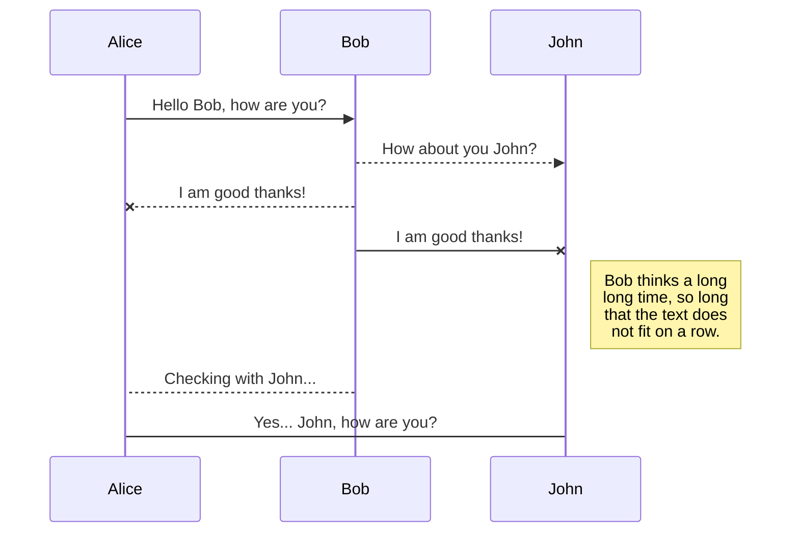
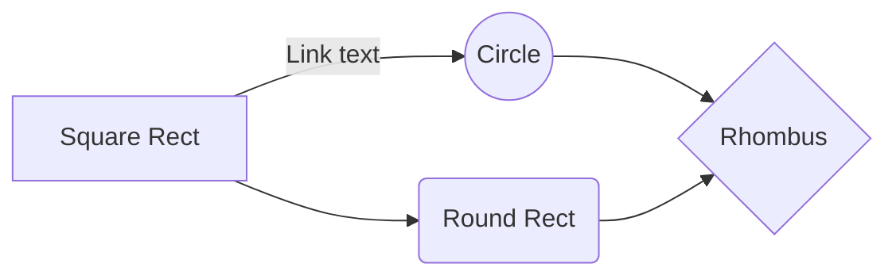

# HttpKernel - Symfony

**Índice**
1. [Introducción](#punto1)
2. [Flujo de trabajo de una solicitud](#punto2)
3. [Punto 3](#punto3)
4. [Anotaciones](#anotaciones)


<div id="punto1"></div>

## 1. Introducción
El componente de HttpKernel da la posibilidad de convertir una solicitud (_Request_) en una respuesta (_Response_) utilizando EventDispatcher. Es flexible y permite crear proyectos avanzados. Para instalarlo, primero crea un proyecto:
```bash
symfony new --webapp ProyectoHttpKernel
```
Tras haber creado el proyecto correctamente, instala el componente:
```bash
composer require symfony/http-kernel
```


<div id="punto2"></div>

## 2. Flujo de trabajo de una solicitud
Para entender como funciona Symfony cuando un usuario accede a la página web, observa el siguiente diagrama:
```flow
start=>start: Inicio
final=>end: Fin

paso1=>operation: El usuario solicita un recurso en un navegador
paso2=>operation: El navegador envía una solicitud al usuario
paso3=>operation: Symfony le da a la aplicación un objeto del tipo Request
paso4=>operation: La aplicación genera un objeto Response
utilizando los datos del objeto Request 
paso5=>operation: El servidor devuelve la respuesta al navegador
paso6=>operation: El navegador muestra el recurso al usuario

start->paso1->paso2->paso3->paso4->paso5->paso6->final
```


### Sequence Diagram
                    
```seq
Andrew->China: Says Hello 
Note right of China: China thinks\nabout it 
China-->Andrew: How are you? 
Andrew->>China: I am good thanks!
```


<div id="punto3"></div>

## Punto 3
Lorem ipsum


<div id="anotaciones"></div>

## Anotaciones
- Anotación 1
- Anotación 2
- Anotación 3

> Note: `--capt-add=SYS-ADMIN` is required for PDF rendering.

> The overriding design goal for Markdown's
> formatting syntax is to make it as readable
> as possible. The idea is that a
> Markdown-formatted document should be
> publishable as-is, as plain text, without
> looking like it's been marked up with tags
> or formatting instructions.




And this will produce a flow chart:



- [x] GFM task list 1
- [x] GFM task list 2
- [ ] GFM task list 3
    - [ ] GFM task list 3-1
    - [ ] GFM task list 3-2
    - [ ] GFM task list 3-3
- [ ] GFM task list 4
    - [ ] GFM task list 4-1
    - [ ] GFM task list 4-2
