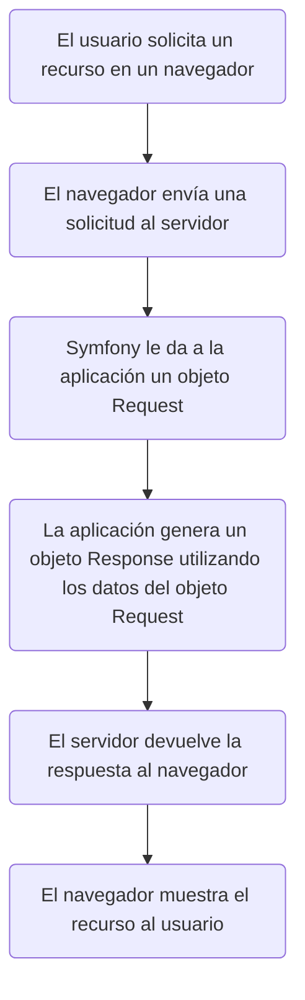

# HttpKernel - Symfony

**Índice**
1. [Introducción](#punto1)
2. [Flujo de trabajo de una solicitud](#punto2)
3. [Punto 3](#punto3)
4. [Anotaciones](#anotaciones)


<div id="punto1"></div>

## 1. Introducción
El componente de HttpKernel da la posibilidad de convertir una solicitud (_Request_) en una respuesta (_Response_) utilizando EventDispatcher. Es flexible y permite crear proyectos avanzados. Para instalarlo, primero crea un proyecto:
```bash
symfony new --webapp ProyectoHttpKernel
```
Tras haber creado el proyecto correctamente, instala el componente:
```bash
composer require symfony/http-kernel
```


<div id="punto2"></div>

## 2. Flujo de trabajo de una solicitud
Para entender como funciona Symfony cuando un usuario accede a la página web, observa el siguiente diagrama:

